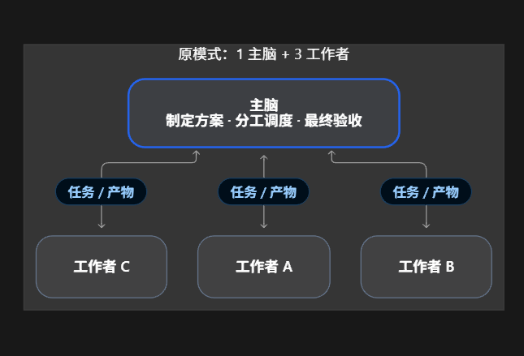

# Luna Worker：在 Codex 中直接使用的项目级 Agent

`luna_worker` 是一个处理边界清晰的独立子任务的 Codex Agent，使用 `gpt-5.6-luna` 和 `max`。仓库同时附有 Sol 主控验收 Skill。

## 协作方式：1 个主脑 + 3 个工作者（示意）

主脑负责制定方案、划分边界、协调依赖并最终验收。工作者 A、B、C 分别处理可独立完成的任务，交回产物与检查结果；主脑亲自核对后整合。`luna_worker` 是可选用的工作者配置，图中的 **3 个工作者只是示例**：打开仓库不会自动创建或启动他们；实际是否委派、派几个，由任务需要、当前客户端能力和用户指令决定。简单任务可以由主脑直接完成。

## 下载后使用

1. 在 GitHub 选择 **Code → Download ZIP**，解压整个仓库；也可以 `git clone`。
2. 在 **Codex** 中打开解压后的**仓库根目录**作为工作目录，开始**新聊天**。
3. 在支持自定义子代理的界面中选择 `luna_worker`，或输入：“请派 `luna_worker` 调查/完成以下边界清晰的子任务：……，主控验收后汇总。”

仓库内的 [`.codex/agents/luna-worker.toml`](.codex/agents/luna-worker.toml) 是项目级 Agent 配置；Codex 在这个项目中读取它。下载 ZIP 后不需要为了**这个项目**再复制到个人目录。请保留 `.codex` 隐藏目录；只打开 README、GitHub 网页或其他项目，不会加载这个 Agent。若新聊天未出现，检查打开的是仓库根目录和账号是否支持指定模型，再重启 Codex。

这不是一个可从插件目录安装的插件。GitHub 上传、GitHub Pages 部署或仅下载文件也不会把 Agent 加进你的**所有** Codex 项目；它只在打开本仓库时是项目级配置。要在任何项目都能调用，请使用下文的全局安装方式。[官方自定义 Agent 文档](https://learn.chatgpt.com/docs/agent-configuration/subagents)

## 全局安装（可选）

将 [`agents/luna-worker.toml`](agents/luna-worker.toml) 复制到个人 `~/.codex/agents/luna-worker.toml`，保留目标目录的其他文件；若已有同名配置，先比较内容，避免覆盖自定义修改。新建聊天或重启 Codex，再检查 `luna_worker` 是否可用。全局方式适合在别的仓库也调用它。

## Sol 主控验收 Skill（可选）

[`skills/luna-sol-quality-gate/SKILL.md`](skills/luna-sol-quality-gate/SKILL.md) 是独立的 Skill，**不会因为 Agent 可选就自动安装**。要使用完整委派与验收流程，把整个 `skills/luna-sol-quality-gate` 目录安装到当前 Codex 识别的用户 Skill 目录；按[官方 Skill 文档](https://learn.chatgpt.com/docs/build-skills)确认位置，然后在新聊天调用 `$luna-sol-quality-gate`。主控模型需由使用者自行选择和确认；Skill 不能切换模型，也不能代替实际测试和验收。

## 文件

- [`.codex/agents/luna-worker.toml`](.codex/agents/luna-worker.toml)：项目级入口，打开本仓库即可发现。
- [`agents/luna-worker.toml`](agents/luna-worker.toml)：相同内容，供全局安装。
- [`skills/luna-sol-quality-gate/SKILL.md`](skills/luna-sol-quality-gate/SKILL.md)：可选的主控验收流程。

Agent 格式曾在本机 Codex CLI `0.158.0-alpha.2.1` 检查。是否可调用 `gpt-5.6-luna`、以及 Agent 在具体客户端的显示方式，仍取决于用户账号与 Codex 版本。
